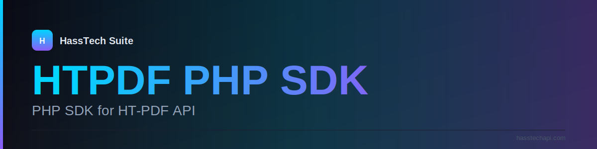

<div align="center">



# HTPDF PHP SDK

### PHP SDK for HT-PDF API

_Official PHP SDK for HTPDF — first-class API client with production-grade error handling, retries, and streaming._

&nbsp;&nbsp;&nbsp;

</div>

---

## 🚀 Features

- **First-class typed API client (PHP 8.1+)**
- **Production-grade retry and timeout policies**
- **Streaming downloads for large PDFs**
- **Advanced authentication** — API keys, scoped tokens
- **Composer-installable, zero runtime dependencies beyond PSR-18**

---

## 🛠️ Tech Stack

  

---

## 📦 Installation

```bash
# Clone
gh repo clone algasid7e/htpdf-php
cd htpdf-php

# Install — see project docs for the exact toolchain
```

---

## 🧪 Usage

See the project's docs and `examples/` directory (where present). The package follows first-class semantic versioning and ships typed APIs.

---

## 📜 License

MIT

---

<div align="center">

**Built by [Hassan Algasid](https://hasstechapi.com) · Part of the [HassTech Suite](https://hasstechapi.com)**

[Website](https://hasstechapi.com) · [Contact](https://hasstechapi.com/contact)

</div>
